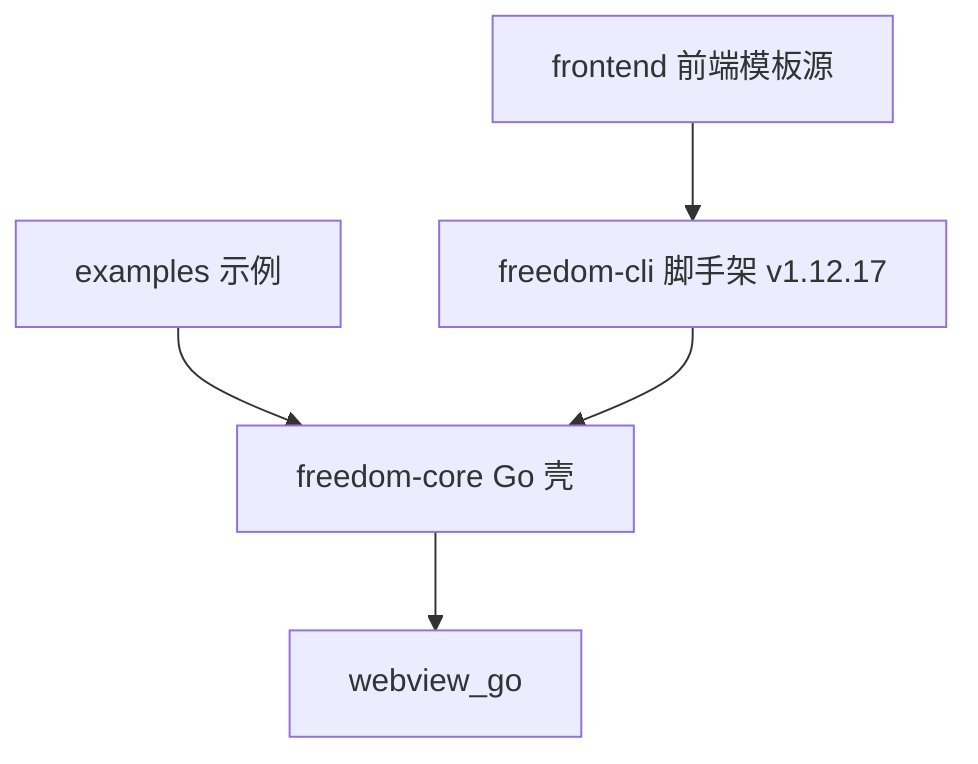

# Freedom 图鉴（v4）

> freedom (自研 desktop exe 打包框架) · 生成于 2026-08-29T19:45:00+08:00

## 分片统计

| 分片 | 条目数 | lastUpdated |
| --- | --- | --- |
| map | 文件 66 · 模块 4 · 函数 43 | 2026-08-29T19:10:01+08:00 |
| bugs | 48（open 0 / fixed 48） | 2026-08-29T19:45:00+08:00 |
| lessons | 5 | 2026-08-29T19:45:00+08:00 |
| decisions | 4 | 2026-08-29T19:10:01+08:00 |
| links | 边 53 | 2026-08-29T19:45:00+08:00 |

## Open 的 critical / major 缺陷

无 —— 全部缺陷已闭环（回归证据见 bugs.md）

## 模块依赖总览

## 查询指引

- 结构/调用链：`map.json` / [map.md](map.md)
- 缺陷登记表：`bugs.json` / [bugs.md](bugs.md)
- 教训：`lessons.json` / [lessons.md](lessons.md)
- 决策：`decisions.json` / [decisions.md](decisions.md)
- 跨片关联：`links.json`（当前 53 条边）
