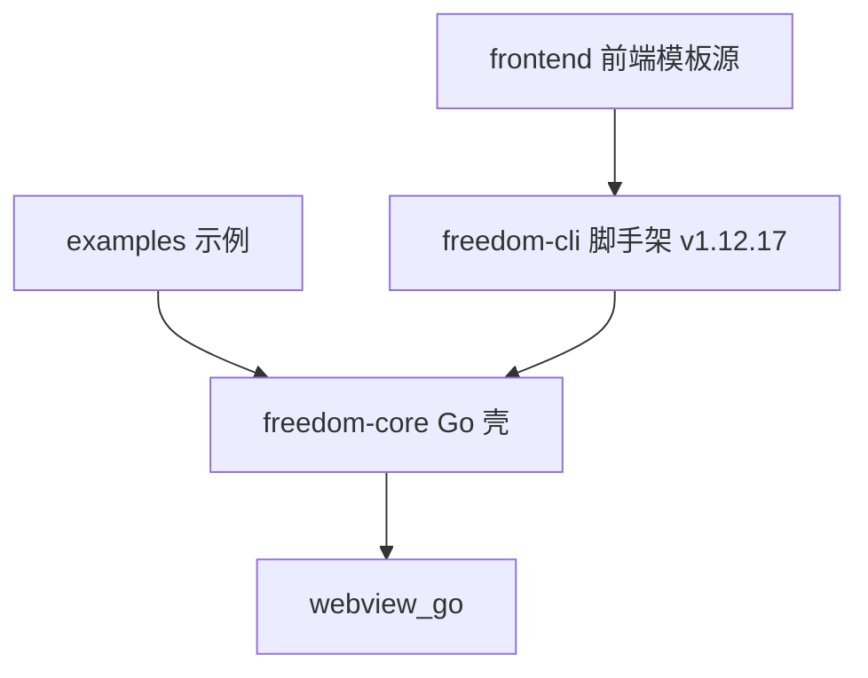
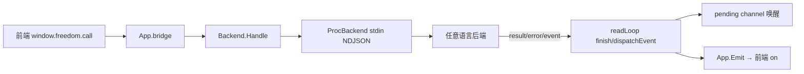

# 地图（map）

更新于 2026-08-29T19:10:01+08:00

## 模块职责

| 模块 | 路径 | 职责 | 依赖 |
| --- | --- | --- | --- |
| freedom-core | `.` | Go 核心运行时：webview 封装、前后端 bridge、后端进程管理、窗口与进程隐藏 | github.com/webview/webview_go |
| freedom-cli | `freedom-cli` | Node CLI 脚手架 v1.12.17：init/build/config/shell/tutorial/tui/update + 安全模式（资源加密/反调试）+ 预编译壳分发 | github.com/webview/webview_go |
| frontend | `frontend` | 前端模板源 | — |
| examples | `examples` | 示例项目（hello / multiproc） | — |

## 模块依赖

## 关键调用链（IPC 主链路）

## 文件清单

66 个文件（含 2026-08-29 补登的 freedom-cli/lib/{security,update,dmg,theme}.js），明细见 `map.json` 的 `files`。
